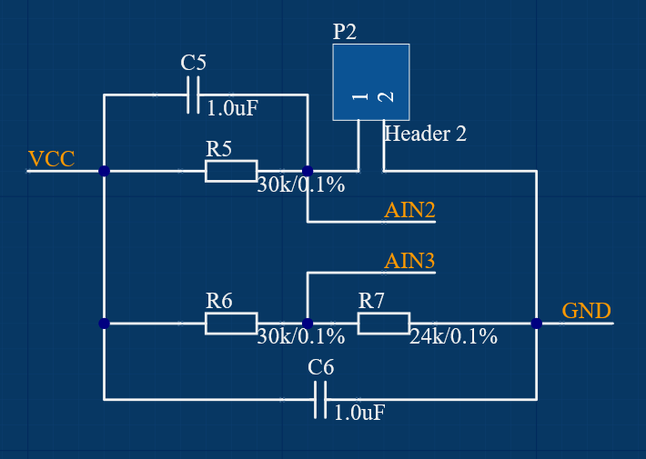
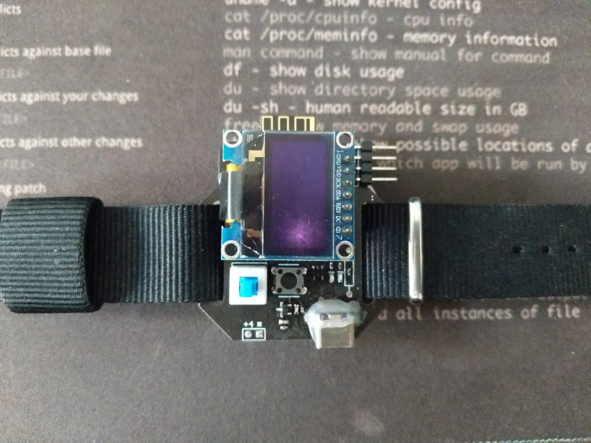
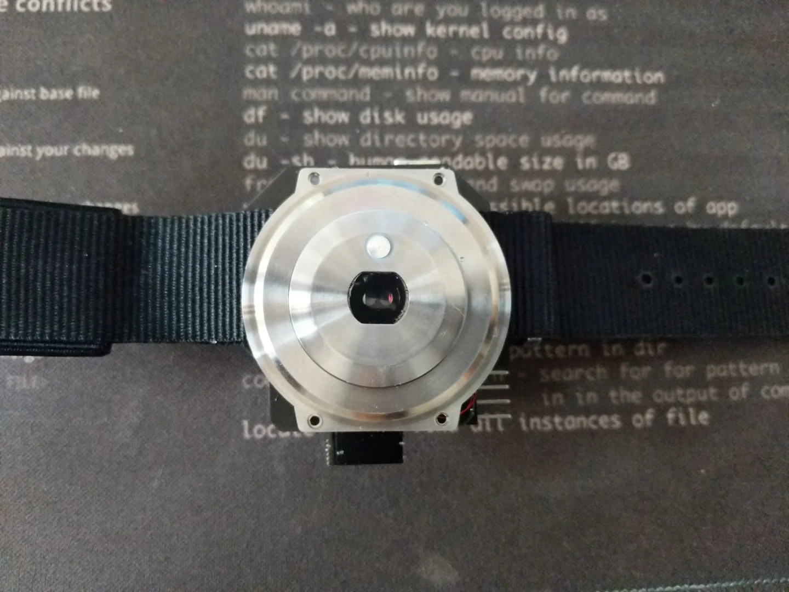
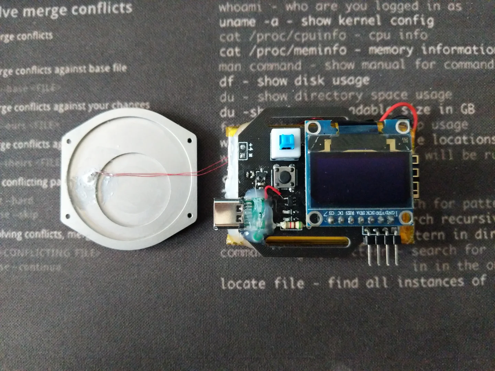
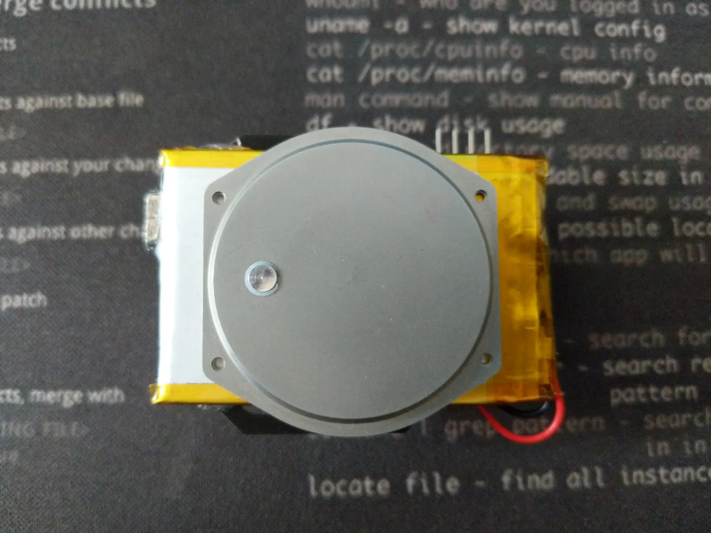
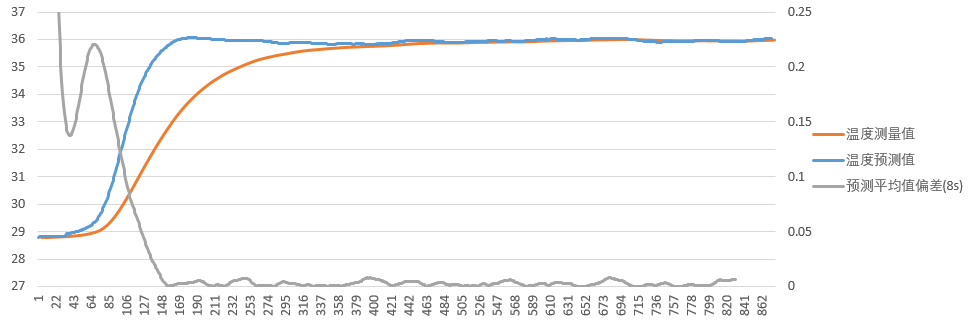
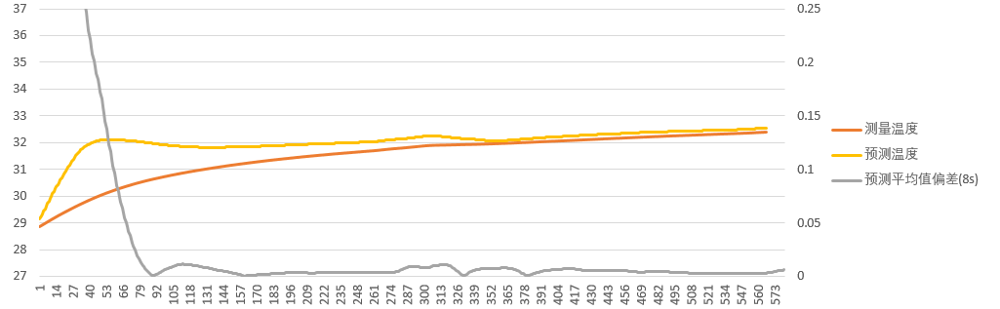

# Comi-tempo-EV

本项目为nRF52-ADC体温测量评估工程

### 外设

- LED
- OLED
- NTC测温电阻
- 按键

### pin map

- LED
	- `P0.17`:低有效
- OLED
	- CS:`P0.16`
	- DC:`P0.15`
	- RES:`P0.14`
	- MOSI:`P0.13`
	- SCLK:`P0.12`
- KEY
	- `P0.06`:高有效
- NTC
	- Positive:`AIN2`
	- Negative:`AIN3`

## 硬件设计

### 测温分压原理

### 评估板展示

## 评估方式

NTC电阻的阻值方程为：

$$R_t=R_0e^{-B(\frac{1}{t_x}-\frac{1}{t_0})}$$

根据ADC测量，又有：

$$R_t=\frac{U_tR_f}{U_0-U_t}$$

其中$R_f$为分压电阻阻值，大小为$30k\Omega$

联立上式易得：

$$t_x=\frac{Bt_0}{t_o\ln\frac{U_t}{U_0-U_t}+B}$$

即可计算得到NTC电阻温度。

上式中有一个自然对数需要计算，使用如下方式对其进行泰勒展开：

$$\ln(x)=\ln(\frac{1+y}{1-y})=2y(\frac{1}{1}+\frac{1}{3}y^2+\frac{1}{5}y^4+\frac{1}{7}y^6+...)$$

其中$y=\frac{x-1}{x+1} 其中 x>0$

又因为当$y$越接近0时，以上级数收敛越快，利用对数的性质可以将$x$变换到接近于1的区间。

然后，我们使用牛顿冷却定律作为热传导模型。粗略的认为NTC电阻的温度变化率与当前NTC电阻的温度跟终端温度的差值成正比关系，其比例与热导率相关。

## 评估结果

### 裸探头测量

当使用裸探头直接接触人体小臂背部皮肤，并以手指自然压紧时，得到如下测量曲线：

图中采样率为`25 samples/s`，可以看到使用牛顿冷却模型的算法比实际探头测量值提前了约13秒便得到了准确的终端温度。所以使用`nRF52832`内置`ADC`在裸探头测量体表体温的场景下应当是可行的方案。

### 表壳测量

当使用导热胶将探头安装至金属表壳上，其中测温部分的金属接触面与表壳其他部分使用了绝热材料进行隔离，以减小大面积表壳与空气的热交换对测量产生的影响。此时得到的测量曲线如下：

可以看到，将探头安装至表壳后，热导率有非常显著的下降，导热速率明显变慢，以至于以`nRF52832`内置`ADC`的精度无法再进行正确的预测。所以，这里认为使用内置`ADC`在表壳测量的场景下测量体表体温精度不够，是不可行的方案。

